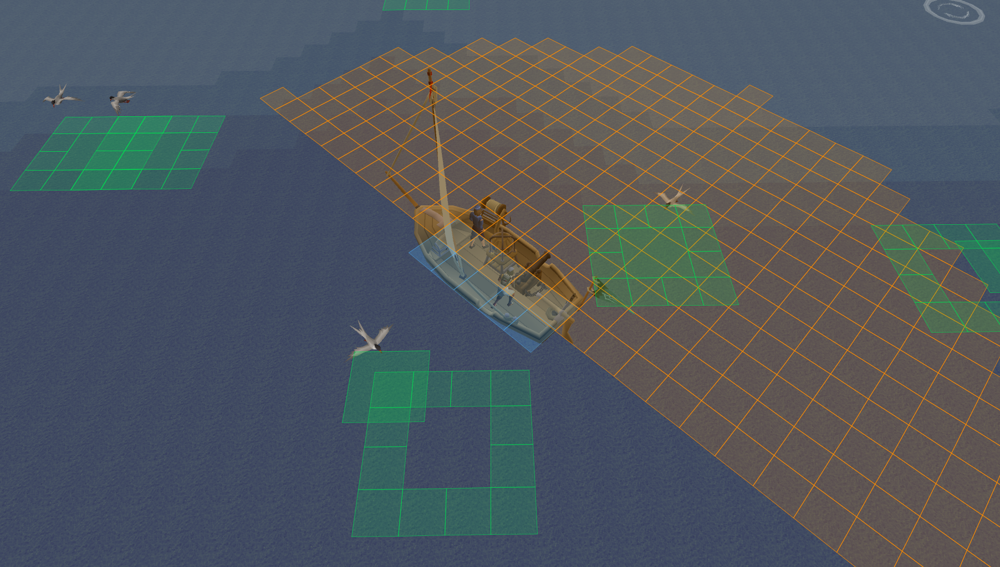
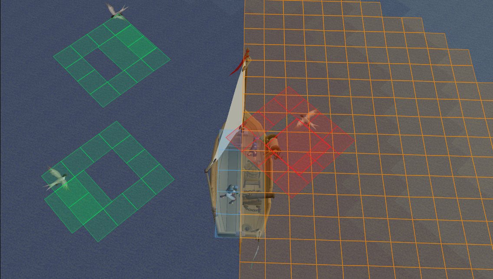

# Ship Combat

A RuneLite plugin designed to help with ship combat. This plugin provides visual overlays that account for the unique "Boat Plane" mechanics, including non-rigid tile rotations and sub-tile distance checking.

## Features

*   **Cannon Firing Arc:** Displays a dynamic 180° firing zone anchored to your cannon facilities, showing exactly which tiles are within range of your cannon.
*   **Rotation Sweep (The Daisy):** Visualizes the "composite footprint" of your ship. This merged shape shows every tile your ship could possibly occupy as it rotates, allowing you to position your ship perfectly.
*   **Dynamic Attack Ranges:** Unlike standard NPCs, sea monster attack ranges are calculated against your ship's **rotated hull**.
    *   **Green:** The monster is safe and cannot hit you.
    *   **Yellow:** The monster has entered your rotation sweep and if aggravated will hit your ship in 1 tick.
    *   **Red:** The monster is in immediate contact with your current hull tiles and will hit your ship instantly if aggravated.
*   **Overhead Combat Timers:** Tick counters for your cannon cooldown and sea monster attack intervals.
*   **Corpse Despawn Timers:** Tracks sea monster remains to show exactly how long you have to loot before they vanish.

## Screenshots

